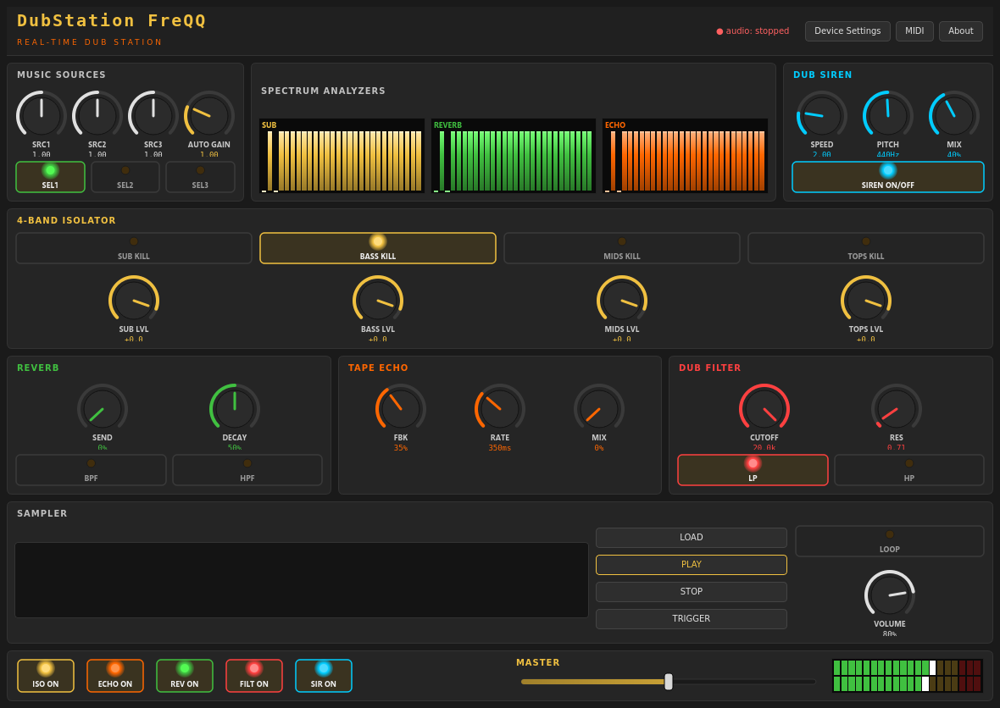

# DubStation FreQQ

**DubStation FreQQ** è una *dub station* digitale in tempo reale per Windows,
ispirata ad **Amp FreQQ v3**. Elabora un flusso audio in ingresso (line-in
esterno **oppure** l'audio di sistema tramite loopback WASAPI) attraverso una
catena DSP completa e la controlla dal vivo con mouse e/o controller MIDI.



---

## Funzionalità

- **Isolatore a 4 bande** (SUB `<80 Hz`, BASS `80–250 Hz`, MIDS `250–4000 Hz`,
  TOPS `>4000 Hz`) con *kill switch* LED e controllo di livello per banda
  (filtri Butterworth 4° ordine implementati come SOS per la stabilità).
- **Reverb Freeverb** (8 comb + 4 all-pass) con Send, Decay e pre-filtri
  BPF/HPF.
- **Tape Echo** a delay con Feedback, Rate, Mix e saturazione a nastro.
- **Dub Filter** risonante TPT (Topology Preserving Transform) LP/HP con
  Cutoff (scala logaritmica) e Resonance.
- **Dub Siren** con 2 LFO indipendenti (pitch + tremolo), Speed, Pitch e Mix.
- **Sample Player** con playlist, LOAD/PLAY/STOP/TRIGGER, loop e volume.
- **Analizzatori di spettro** in tempo reale (SUB / REVERB / ECHO) e **VU meter**.
- **Supporto MIDI** completo (mappa CC predefinita + **MIDI Learn**).
- **Interfaccia dark** professionale in stile dub station (PySide6).

---

## Requisiti

- **Python 3.9 – 3.12** (consigliato 3.11)
- Windows 10/11 (l'app è multipiattaforma, ma il *loopback* dell'audio di
  sistema usa WASAPI ed è disponibile solo su Windows)
- Una scheda audio funzionante; per performance a bassa latenza è consigliata
  un'interfaccia audio con driver adeguati.

---

## Installazione

```bash
# 1. (consigliato) crea un ambiente virtuale
python -m venv .venv
.venv\Scripts\activate        # Windows
# source .venv/bin/activate    # Linux/macOS

# 2. installa le dipendenze
pip install -r requirements.txt

# 3. avvia l'applicazione
python main.py
```

> **Nota su `python-rtmidi`**: su Windows l'installazione da `pip` usa
> ruote precompilate. Se la compilazione fallisse, installa i *Build Tools for
> Visual Studio* oppure una wheel precompilata.

---

## Uso rapido

1. Avvia l'app: `python main.py`.
2. Apri **Device Settings** e scegli:
   - un **input** (line-in esterno) **oppure** una voce **`[Loopback]`** per
     catturare l'audio di sistema (Windows/WASAPI);
   - un **output**.
   Premi **Apply**: il motore audio si riavvia con i device scelti.
3. Fai partire la musica sulla sorgente scelta e agisci in tempo reale su
   isolatore, reverb, echo, filtro e sirena.
4. (Opzionale) Apri **MIDI**, collega il tuo controller e premi **Connect**.

### Controllo MIDI

Mappa **CC** predefinita:

| CC | Parametro | CC | Parametro |
|----|-----------|----|-----------|
| 1–4 | Level SUB/BASS/MIDS/TOPS | 12–13 | Reverb Send / Decay |
| 5–8 | Kill SUB/BASS/MIDS/TOPS | 14–15 | Filter Cutoff / Resonance |
| 9–11 | Echo Feedback / Rate / Mix | 16–17 | Siren Speed / Pitch |
| 18 | Siren On/Off | 19 | Master Level |
| 20–22 | Source 1–3 Gain | | |

- **Note On** → trigger di un sample (numero nota = indice nella playlist).
- **MIDI Learn**: fai **click destro** su un knob o un bottone, scegli
  *"MIDI Learn"* e muovi un controllo sul tuo dispositivo per assegnarlo.

### Controlli dei knob

- **Trascina** verticalmente per cambiare il valore (tieni **Shift** per il
  controllo fine).
- **Doppio click** per riportare al valore di default.
- **Rotellina** del mouse per piccoli step.

---

## Architettura / struttura del progetto

```
dubstation_freqq/
├── main.py              # Entry point (QApplication, avvio/arresto)
├── audio_engine.py      # Motore DSP real-time (sounddevice.Stream)
├── midi_handler.py      # Input MIDI + MIDI Learn (python-rtmidi)
├── dsp/
│   ├── isolator.py      # Isolatore a 4 bande (Butterworth SOS)
│   ├── reverb.py        # Reverb Freeverb (comb + all-pass)
│   ├── tape_echo.py     # Delay tape echo con feedback e saturazione
│   ├── dub_filter.py    # Filtro risonante TPT LP/HP
│   ├── siren.py         # Sirena con 2 LFO
│   └── sampler.py       # Sample player con playlist
├── ui/
│   ├── main_window.py   # Finestra principale (layout completo)
│   ├── styles.py        # Tema scuro (Qt stylesheet)
│   └── widgets/         # Knob, LED button, spectrum, fader, VU meter
├── requirements.txt
└── README.md
```

### Catena di elaborazione

```
input → isolator → reverb → echo → filter → siren mix
      → sampler mix → master gain → output
```

### Thread-safety

I parametri modificati dalla UI (o dal MIDI) sono scritti come **attributi
atomici** letti dal callback audio; le operazioni non atomiche (ricalcolo dei
coefficienti dei filtri, swap di stato) sono protette da `threading.Lock`. Il
callback audio non solleva mai eccezioni: in caso di errore emette silenzio.

---

## Risoluzione problemi

- **Nessun audio / lo stream non parte**: apri *Device Settings* e seleziona
  manualmente input e output. Su Windows preferisci gli host API **WASAPI**.
- **Voglio elaborare l'audio di sistema**: scegli un input che inizia con
  **`[Loopback]`** (solo Windows/WASAPI).
- **Nessun dispositivo MIDI**: verifica che il controller sia collegato prima
  di avviare l'app, poi *MIDI → Connect*.
- **Latenza alta / glitch**: usa un'interfaccia audio con driver a bassa
  latenza; il blocksize di default è 512 campioni a 44.1 kHz.

---

## Note

Progetto ispirato ad Amp FreQQ v3 a scopo di performance dub/reggae. Non
affiliato con il produttore originale.
